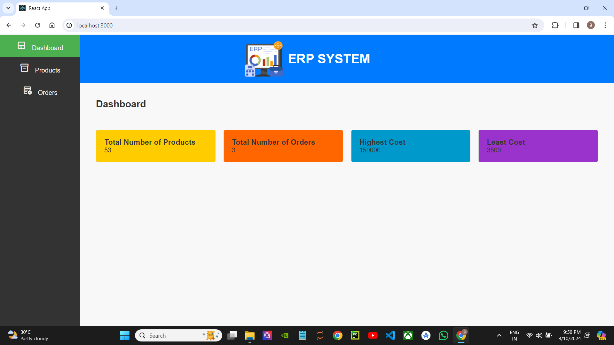
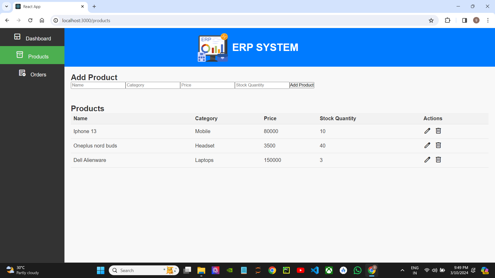
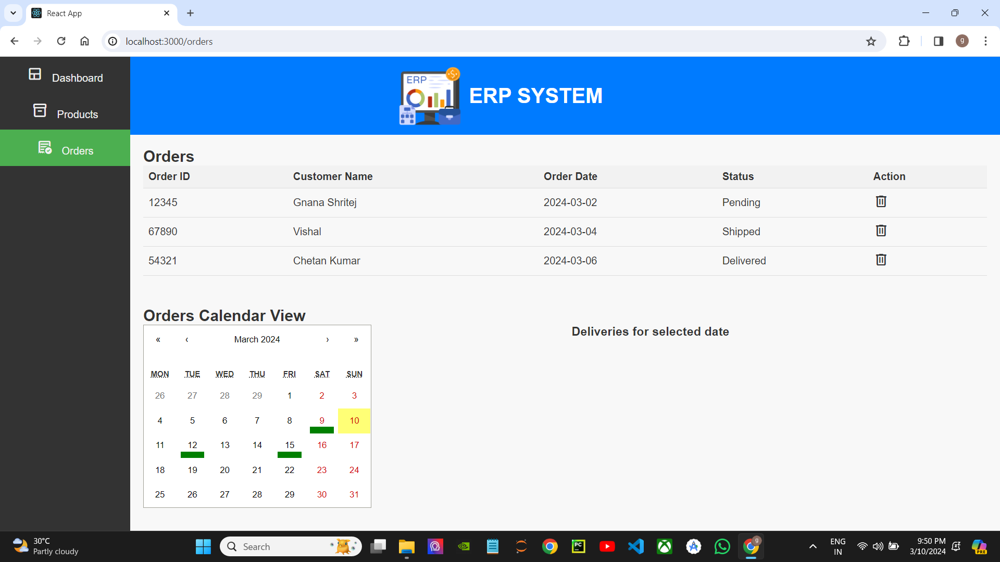

# React ERP System

## Introduction
React ERP System is a web application designed to streamline enterprise resource planning (ERP) processes for businesses. It provides a user-friendly interface for managing various aspects of business operations, including inventory management, order processing, and customer relationship management (CRM).

## Installation
To run the application locally, follow these steps:

1. Clone the repository: `https://github.com/Gnanashritej/erp-react.git`
2. Navigate to the project directory: `cd erp-react`
3. Install dependencies: `npm install`

## Usage
To start the development server, run: `npm start`
Open [http://localhost:3000](http://localhost:3000) to view the application in your browser.

## Folder Structure
- `/src`: Contains the source code for the application.
  - `/components`: Contains React components.
  - `/styles`: Contains CSS stylesheets.
- `/public`: Contains static assets and the index.html file.
- `README.md`: Documentation file.
- `package.json`: Configuration file for npm dependencies.

## Technologies Used
- React.js
- CSS
- HTML
- npm

## Features
- Dashboard: View key metrics and insights about the business.
- Products Management: Add, edit, and delete products from the inventory.
- Orders Management: Process and manage customer orders efficiently.

## Screenshots
Here are some sample screenshots of the application:

### Dashboard

### Products Management

### Orders Management

## Deployment
The application can be deployed to any hosting service. Follow these steps:
1. Build the project: `npm run build`
2. Deploy the build folder to your hosting provider.

## Contributing
Contributions are welcome! Follow these steps to contribute:
1. Fork the repository
2. Create a new branch (`git checkout -b feature`)
3. Commit your changes (`git commit -am 'Add feature'`)
4. Push to the branch (`git push origin feature`)
5. Submit a pull request

## Acknowledgements
- Material Icons: Used for iconography.
- React Router: Used for client-side routing.
- Bootstrap: Used for responsive design.